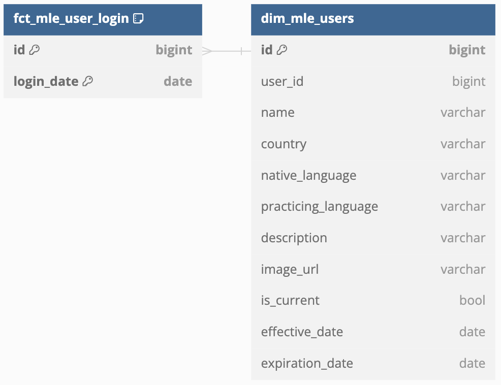
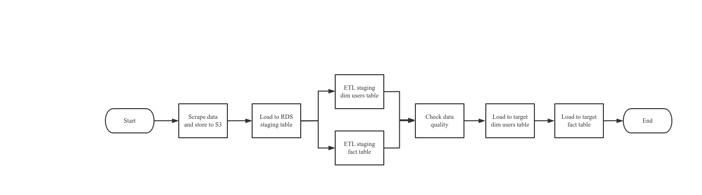

# Crawl and manage data from a language exchange website

English is not my mother language and I believe practicing with native speakers makes perfect. That's the reason why I did some efforts to search for a language exchange website. But I soon found those types of websites are relatively old-fashioned - they just allow users to post their self introductions and language preferences. It's your own job to browse and find your practice partners. There's no easy way to find out who's recommended for your language exchange purpose. This is how the project came out.

In order to have required data to match language learning pairs, I initiated this project to crawl data from a language exchange website (mylanguageexchange.com), extracting and parsing from HTML pages, transforming and loading into the data warehouse. I've leveraged `scrapy` as the scraping tool, AWS `RDS (Relational Database Service)` as the data warehouse, AWS `S3` as the temporary data storage and `Airflow` to manage and orchestrate workflows.

## Overall workflow

Before diving into the detailed steps, let's first take a look at the schema we want in the end.

So this simplified version contains two tables: one is a dimension table called `dim_mle_users` and the other is a fact table called `fct_mle_user_login`. We could write a simple qury to find best candidates for your learning purpose. Similar to dimensional modeling, the dimension table here is actually *changing slowly*. Image myself, as a language learner, may show different interests in foreign languages during different time. That means the field `practicing_language` will change. Even slowly, we need catch them for versioning in case we'll check our historical matching results. This is also valid to other fields like `description`, `country`, etc.. This versioning can be achieved by introducing `effective_date` (start) and `expiration_date` (end) to indicate if a record in the dimension is valid or not. I also created a `is_current` flag for easier filter.

To address the nature of slowly changing dimentional tables, a surrogate key (`id`) along side the natural key (`user_id`) are addressed in the dimension table `dim_mle_users`. And the fact table `fct_mle_user_login` is linked with the dim table via this surrogate key. Please note in this fact table, `id` and `login_date` are selected together as a composite primary key.

Above is the overall workflow. Let's take a look step by step.

### Implement a crawler to fetch the data 
The first task is to incremenally fetch data from the website. The major process managed by `scrapy` is stored in a [scrpay util file](https://github.com/wctjerry/crawl-etl-language-exchangers/blob/main/plugins/scrapy_utils/spiders/mylanguageexchange.py). A few steps contained in this file:

1. Fetch all supported countries from the website. Different countries represent different spoken languages
2. For each country, form a specified url address and trigger a crawler to work on
3. Parse the users' post data on each country specific page for the past two days. Duplicated data will be removed later
4. Export the scraped data in a csv file on AWS S3

This scrapy spider is embedded in a [customized Airflow operator](https://github.com/wctjerry/crawl-etl-language-exchangers/blob/main/plugins/operators/spider_operator.py) called `SpiderOperator`, which will be initiated and managed in the Airflow workflow.

### Load data from AWS S3 to RDS
This task is straightforward. It simply loads data from a S3 csv file to an RDS staging table leveraging an AWS `aws_s3.table_import_from_s3` function. This staging table is the basis of the following ETL steps.

### ETL staging dim and fact tables
The idea of slowly changing dimentional tables is to insert new / updated dimentional records and deprecate the old one. For example, let's say currently there's a user `123` in a dimension table, so it looks like this:

| id | user_id | practicing_language | effective_date | expiration_date | is_current |
|----|---------|---------------------|----------------|-----------------|------------|
| 1  | 123     | English             | 2022-01-01     | 9999-12-31      | True       |

And then the user prefers Japanese more than English. Then the table will become this:

| id | user_id | practicing_language | effective_date | expiration_date | is_current |
|----|---------|---------------------|----------------|-----------------|------------|
| 1  | 123     | English             | 2022-01-01     | 2022-03-31      | False      |
| 2  | 123     | Japanese            | 2022-04-01     | 9999-12-31      | True       |

So you get the idea. When we insert a new record, we also reset the previous record by changing the flag `is_current` from True to False, and set `expiration_date` to the last valid date.

In the step of ETL staging dimentional table, we created a [temp table](https://github.com/wctjerry/crawl-etl-language-exchangers/blob/main/dags/sql/language_exchange/create_staging_dim_mle_users.sql) to indicate changed records (`is_changed`) which will be a helper for implementing above logics in the following steps. The step of ETL staging fact table is relatively simple. The logic could be viewed [here](https://github.com/wctjerry/crawl-etl-language-exchangers/blob/main/dags/sql/language_exchange/create_staging_fct_login.sql).

### Check data quality
Before we load to the target tables, we would verify if the data "looks good". You could do a bunch of data quality checks based on your upstream assumptions and reasonable trends, but in this project, I simply [check fluctuation](https://github.com/wctjerry/crawl-etl-language-exchangers/blob/ca63df4e3333bf3808a822ad909bb9337258ea6c/dags/dag_scrapy_my_language_exchange.py#L77) of the activities falling into the expected range (90% - 110%) or not.

### Load to the target table with idempotency
The last step is load the checked data into the final tables. As it touches our final tables, one of the considerations is that what if this step will be triggered more than once. In the data engineering world it is always possible because data is never perfect, and we need to retrigger when needed, but we don't want this scenario would cause any side effects, which means we need to ensure idempotency. So the first step is to remove all the changes that was introduced in the previous triggers, and reset `expiration_date` and `is_current` flag. This logic is handled [here](https://github.com/wctjerry/crawl-etl-language-exchangers/blob/ca63df4e3333bf3808a822ad909bb9337258ea6c/dags/sql/language_exchange/etl_dim_mle_users.sql#L3-L20). After we reset the changes, then we're more confident to load the new data into the target tables.